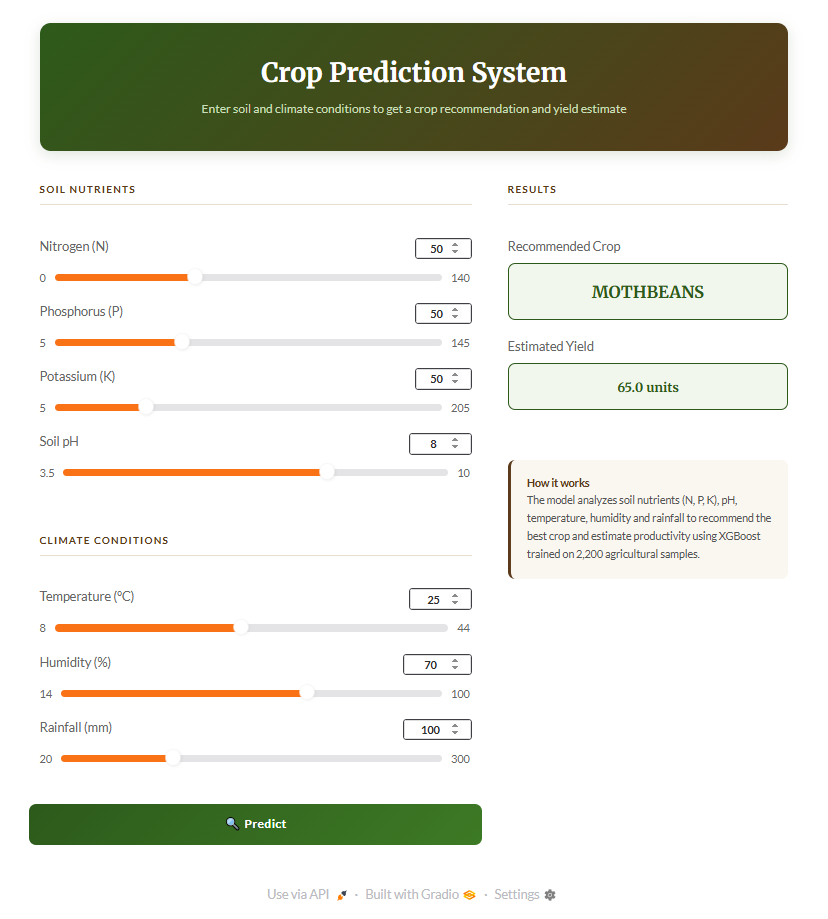
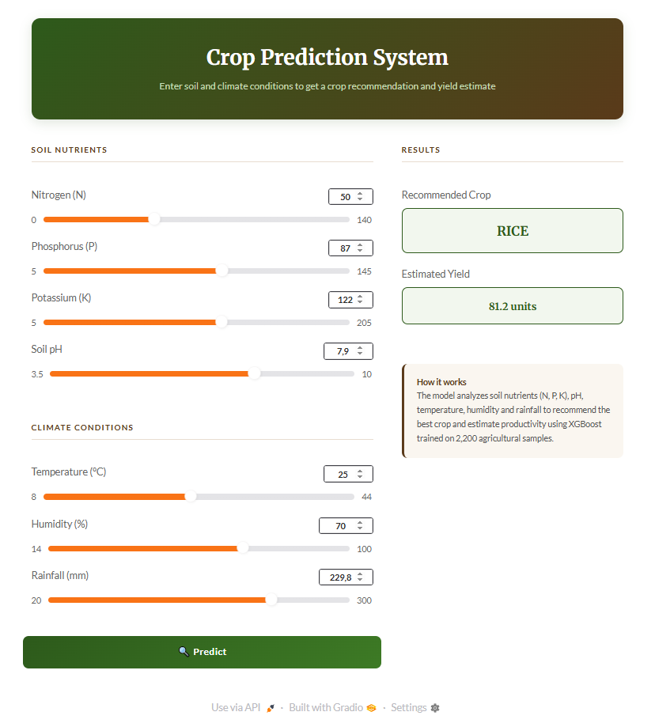
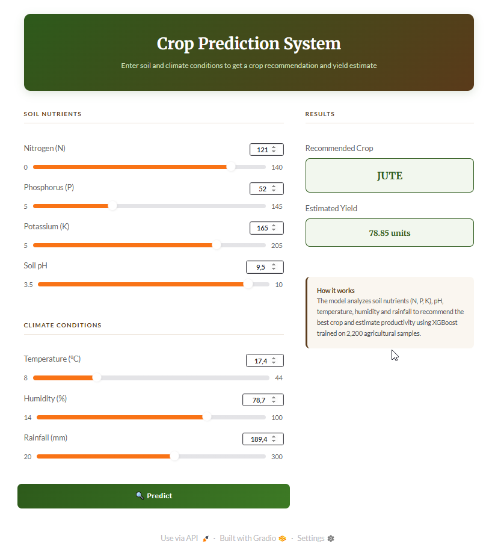

# Crop Prediction System

A machine learning system that recommends the best crop to plant and estimates yield based on soil and climate conditions. Built with a full data engineering pipeline: BigQuery → PostgreSQL → XGBoost → Gradio.


---

## What does it do?

Given soil nutrient levels and climate conditions, the system:

1. **Classifies** which crop is most suitable for planting (22 possible crops)
2. **Estimates** the expected yield based on the same inputs

Both predictions run simultaneously and are displayed in a clean web interface.

---

## Screenshots

<p>
  
  
  
</p>

---

---

## Architecture

```
Google BigQuery          PostgreSQL (Docker)       ML Models
─────────────────        ───────────────────       ─────────────────────
Raw CSV data      ──►    Structured storage  ──►   XGBoost Classifier
(crop_recommendation)    (crop.crop_data)          XGBoost Regressor
                                                          │
                                                          ▼
                                                   Gradio Interface
                                                   (localhost:7860)
```

---

## Tech Stack

| Layer | Tool | Purpose |
|---|---|---|
| Data warehouse | Google BigQuery | Store and query raw data via SQL |
| Data store | PostgreSQL 17 (Docker) | Structured local database |
| ORM / connector | SQLAlchemy + psycopg2 | Python ↔ PostgreSQL bridge |
| ML - Classification | XGBoost Classifier | Predict best crop |
| ML - Regression | XGBoost Regressor | Estimate yield |
| Model persistence | Pickle | Save/load trained models |
| Interface | Gradio | Interactive web UI |
| Containerization | Docker + docker-compose | Reproducible environment |

**Total infrastructure cost: $0**

---

## Dataset

**Crop Recommendation Dataset** — [Kaggle](https://www.kaggle.com/datasets/atharvaingle/crop-recommendation-dataset)

- 2,200 samples across 22 crop types
- Features: N, P, K (soil nutrients), temperature, humidity, pH, rainfall
- Target: crop label (classification) / simulated yield (regression)

---

## Project Structure

```
.
├── config.py               # BigQuery and PostgreSQL credentials
├── extract.py              # ETL: BigQuery → PostgreSQL
├── train.py                # Train XGBoost classifier and regressor
├── docker-compose.yml      # PostgreSQL container definition
├── models/
│   ├── classifier.pkl      # Trained XGBoost classifier
│   ├── label_encoder.pkl   # Label encoder for crop names
│   └── regressor.pkl       # Trained XGBoost regressor
├── app/
│   └── app.py              # Gradio web interface
└── your-gcp-key.json       # GCP service account key (not committed)
```

---

## Setup

### Prerequisites

- Python 3.10+
- Docker Desktop
- Google Cloud account (free tier)

### 1. Clone the repository

```bash
git clone https://github.com/your-username/crop-prediction.git
cd crop-prediction
```

### 2. Install dependencies

```bash
pip install pandas sqlalchemy psycopg2-binary google-cloud-bigquery \
            xgboost gradio scikit-learn db-dtypes numpy
```

### 3. Configure BigQuery

- Create a project on [console.cloud.google.com](https://console.cloud.google.com)
- Create a service account with **BigQuery Data Viewer** and **BigQuery Job User** roles
- Download the JSON key and place it in the project root
- Upload the dataset CSV to BigQuery as `your_project.crop_data.crop_recommendation`

### 4. Configure credentials

Edit `config.py`:

```python
PROJECT_ID = "your-project-id"
DATASET = "crop_data"
TABLE = "crop_recommendation"
CREDENTIALS_PATH = "your-key.json"

PG_HOST = "localhost"
PG_PORT = "5432"
PG_USER = "admin"
PG_PASSWORD = "admin123"
PG_DB = "crop_db"
```

> ⚠️ Add `config.py` and `*.json` to `.gitignore` before pushing.

### 5. Start PostgreSQL

```bash
docker-compose up -d
```

### 6. Run ETL pipeline

```bash
python extract.py
```

Extracts ~2,200 rows from BigQuery and loads them into PostgreSQL.

### 7. Train the models

```bash
python train.py
```

Trains both models and saves them to `models/`.

### 8. Launch the app

```bash
python app/app.py
```

Opens at `http://localhost:7860`

> The app uses `__file__`-based paths to locate the `models/` folder, so it works correctly regardless of which directory you run the command from.

---

## Model Performance

**Classifier (XGBoost)**

| Metric | Score |
|---|---|
| Overall accuracy | ~99-100% |
| Macro avg F1-score | 1.00 |
| Test set size | 440 samples (20%) |

**Regressor (XGBoost)**

| Metric | Score |
|---|---|
| RMSE | ~5.90 |

> Note: the yield column is simulated from soil/climate features with realistic noise, as the original dataset does not include productivity data.

---

## Example Inputs

| Condition | Value |
|---|---|
| Nitrogen (N) | 90 |
| Phosphorus (P) | 42 |
| Potassium (K) | 43 |
| Temperature | 20.8°C |
| Humidity | 82% |
| pH | 6.5 |
| Rainfall | 202mm |

**Result:** Rice · Yield: 68.4 units

---

## License

MIT
